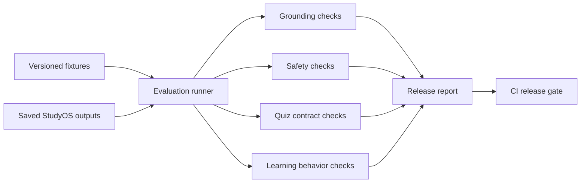

# StudyOS Evals PRD

## Product

StudyOS Evals is a small independent release-gate harness for saved learning
workflow artifacts. It evaluates explicit lexical, citation, refusal, quiz,
mastery-direction, and study-plan contracts.

## Problem

Teams often test whether an endpoint responds, but not whether saved outputs
still satisfy the narrow contracts their product relies on. Those regressions
can ship even when ordinary integration tests remain green.

## Goals

- Check required and forbidden token sequences in saved tutor answers.
- Check citation presence and allowlists.
- Detect configured refusal markers and forbidden answer patterns.
- Check quiz fields, difficulty bounds, answer/explanation alignment, and citations.
- Verify expected mastery direction and study-plan prioritization.
- Produce human-readable and JSON release reports.
- Fail CI when required thresholds are missed.

## Non-goals

- Calling or judging live hosted models.
- Replacing educator review.
- Producing a universal learning-quality score.
- Certifying factuality, safety, pedagogy, or learning outcomes.
- Performing semantic similarity or model-based judging.

## Evaluation Dimensions

- Grounding: required token sequences are present and configured forbidden sequences are absent.
- Citations: minimum citation count and allowed source identifiers.
- Refusal policy: configured refusal markers and forbidden answer sequences.
- Quiz contract: required fields, difficulty bounds, answer/explanation alignment, and citations.
- Learning behavior contract: correct and incorrect answers move mastery in expected directions.
- Release health: aggregate pass rate must meet the configured threshold.

## Architecture

## Principal Engineering Decisions

- Run independently from the platform repository.
- Evaluate saved artifacts so failures are reproducible.
- Keep each check explainable and traceable to a fixture.
- Prefer multiple narrow dimensions over one opaque score.
- Version fixtures as product contracts.
- Reject duplicate fixture IDs and malformed saved artifacts.

## Success Criteria

- CLI exits nonzero below the configured pass threshold.
- Reports identify the exact fixture and failed dimension.
- Sample release artifacts demonstrate both passing and failing cases.
- Tests cover lexical boundaries, citations, refusal markers, quiz contracts,
  malformed artifacts, duplicate fixtures, learning contracts, and thresholds.
