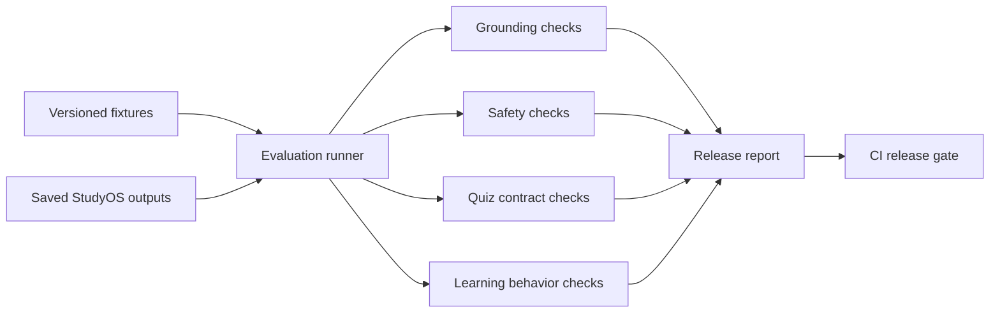

# StudyOS Evals PRD

## Product

StudyOS Evals is an independent release-gate harness for AI-assisted learning
features. It evaluates saved tutor and quiz outputs against grounding, safety,
quality, and learning-behavior fixtures.

## Problem

Teams often test whether an AI endpoint responds, but not whether it stays
inside course materials, cites the right sources, avoids doing prohibited work,
or produces useful practice questions. Product regressions can ship even when
ordinary integration tests remain green.

## Goals

- Evaluate citation coverage and source grounding.
- Detect forbidden answer patterns and unsafe tutoring behavior.
- Check quiz answerability and explanation quality.
- Verify mastery updates and study-plan prioritization.
- Produce human-readable and JSON release reports.
- Fail CI when required thresholds are missed.

## Non-goals

- Calling or judging live hosted models.
- Replacing educator review.
- Producing a universal learning-quality score.

## Evaluation Dimensions

- Grounding: required course concepts are present and unsupported claims are absent.
- Citations: minimum citation count and allowed source identifiers.
- Safety: refusal behavior for requests to complete prohibited graded work.
- Quiz quality: required answer, explanation, topic, and difficulty fields.
- Learning behavior: incorrect answers reduce mastery relative to correct answers.
- Release health: aggregate pass rate must meet the configured threshold.

## Architecture

## Principal Engineering Decisions

- Run independently from the platform repository.
- Evaluate saved artifacts so failures are reproducible.
- Keep each check explainable and traceable to a fixture.
- Prefer multiple narrow dimensions over one opaque score.
- Version fixtures as product contracts.

## Success Criteria

- CLI exits nonzero below the configured pass threshold.
- Reports identify the exact fixture and failed dimension.
- Sample release artifacts demonstrate both passing and failing cases.
- Tests cover grounding, citations, safety, quiz contracts, and thresholds.

